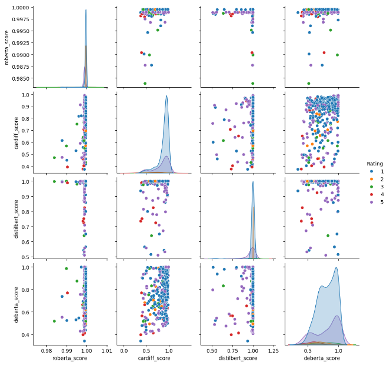
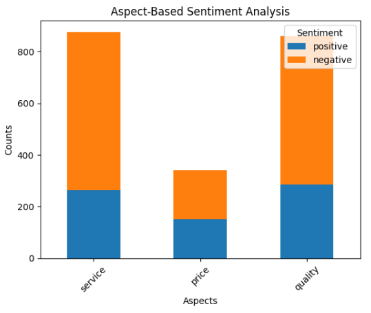

# Sentiment-Analysis-of-Customer-Reviews

This repository provides a comprehensive implementation of sentiment analysis on customer reviews using pretrained models. The primary objective of this project is to web scrape customer reviews and identify the most effective model for classifying these reviews into positive and negative categories. By analyzing sentiment, this project aims to uncover valuable insights from customer feedback, which can significantly inform and enhance business decision-making processes.

## Project Overview

The core features of this project include:
- Web scraping of customer reviews from the Zalando website.
- Loading and preprocessing of the scraped reviews from a CSV file.
- Sentiment classification using multiple pretrained models such as:
  - **RoBERTa** (`siebert/sentiment-roberta-large-english`)
  - **Cardiff NLP RoBERTa** (`cardiffnlp/twitter-roberta-base-sentiment`)
  - **DistilBERT** (`distilbert-base-uncased-finetuned-sst-2-english`)
  - **DeBERTa** (`yangheng/deberta-v3-large-absa-v1.1`)
- Comparative evaluation of model performance based on key metrics.
- Data visualization to illustrate the sentiment distribution and inter-model correlations.
- Aspect-based sentiment analysis focusing on specific aspects like service, price, and quality.

## Project Structure

- `Benchmark_Sentiment_Analysis_models.ipynb`: This Jupyter Notebook delves into the benchmarking of various sentiment analysis models to determine the most effective one for classifying a small set (475 reviews) scraped of customer reviews, as positive or negative. It emphasizes the systematic evaluation of key performance metrics, including accuracy, precision, recall, and F1-score, to provide a comprehensive understanding of each model's capabilities. In addition to these metrics, the notebook includes an analysis of the distribution scores of the models, offering insights into how each model's predictions align with the actual sentiment labels.
- `Sentiment_Analysis_Zolando_reviews.ipynb`: This Jupyter Notebook is dedicated to conducting sentiment analysis using the top-performing model from our benchmark, the RoBERTa model, on a substantial dataset of 1,958 customer reviews scraped from the Zalando website. By leveraging the RoBERTa model's capabilities, the notebook not only classifies the reviews into positive and negative sentiments but also provides a comprehensive examination of the resulting data, highlighting trends and patterns that can inform business strategies.
- `README.md`: Documentation outlining project details (this file).

## Results
- **Benchmark Results :**

| Model       | Accuracy | Precision | Recall  | F1-score |
|-------------|----------|-----------|---------|----------|
| RoBERTa     | **0.9339**   | **0.9341**    | **0.9339**  | **0.9328**   |
| DistilBERT  | 0.8785   | 0.8823    | 0.8785  | 0.8724   |
| DeBERTa     | 0.9168   | 0.9193    | 0.9168  | 0.9142   |
| Cardiff NLP | 0.9083   | 0.9101    | 0.9083  | 0.9054   |

- **Sentiment Analysis Models on Confidence, Uncertainty, and Correlation Results :**
  
- **Aspect-based sentiment analysis focusing on specific aspects like service, price, and quality :**
  
  

  

### Required packages

To execute this project, ensure that you have the following dependencies installed:

- Python 3.x
- PyTorch
- Hugging Face `transformers`
- NLTK (for natural language processing tasks)
- Seaborn and Matplotlib (for data visualization)

